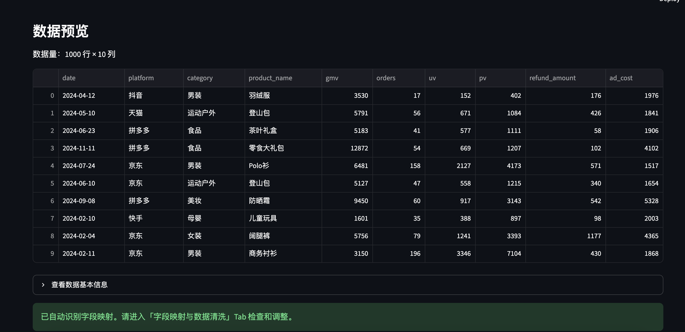
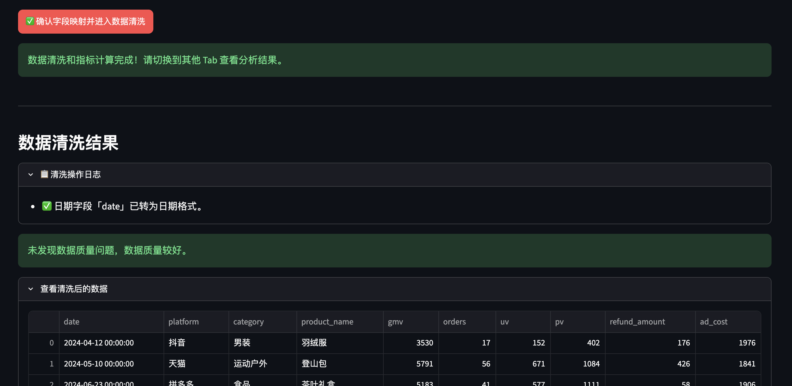
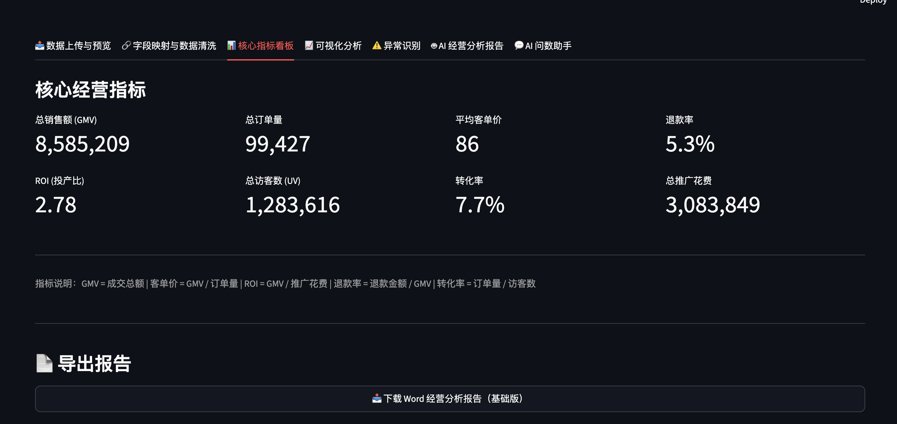
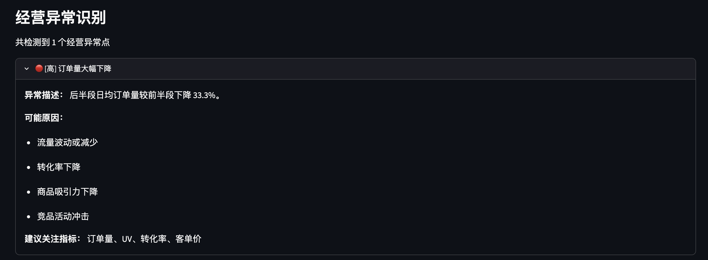
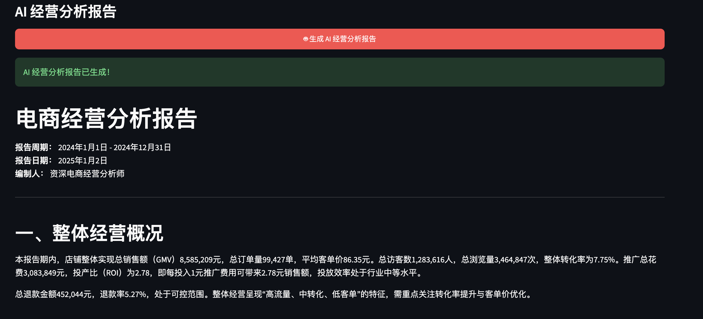

# 📊 AI 企业经营分析 Agent

一个面向电商/零售场景的 AI 辅助经营分析工具。上传原始经营数据，系统自动完成指标计算、趋势可视化、异常诊断，并生成结构化的经营分析报告。

---

## 项目简介

传统经营分析高度依赖人工处理数据——运营人员需要手动拉取 Excel、计算指标、制作图表、撰写分析报告。这个项目尝试用 Python 技术栈解决这个问题：用户上传结构化数据后，系统自动完成清洗、计算、可视化、异常检测和报告生成，把分析时间从小时级压缩到分钟级。

项目定位为第一版 MVP，不追求复杂架构，但求完整、可运行、可演示。

## 项目亮点

- **完整闭环**：上传数据 → 指标计算 → 图表展示 → 异常诊断 → 报告导出，全链路可跑通，不需要手动拼接任何步骤
- **零配置体验**：内置 1000 行样例数据，开箱即用，无 API Key 也能展示全部核心功能
- **AI 能力可选**：AI 报告和问答功能按需配置（支持 DeepSeek / OpenAI），非 AI 模块完全独立，互不影响
- **贴近真实业务**：指标体系设计参考电商经营分析常用框架，异常规则覆盖 8 种真实场景
- **求职友好**：代码模块化、中文注释完整，附带可直接使用的简历描述和面试讲解思路

## 功能截图

> 以下截图来自实际运行效果。使用方式：启动应用 → 点击「使用样例数据」→ 依次截图。<br>
> 截图保存到 `images/` 目录后生效。

| 页面 | 截图 |
|------|------|
| 数据上传与预览 |  |
| 字段映射与数据清洗 |  |
| 核心指标看板 |  |
| 可视化分析 |  |
| 异常识别 |  |
| AI 经营分析报告 |  |

## 技术栈

| 类别 | 技术 | 用途 |
|------|------|------|
| 语言 | Python 3.11 | 核心开发语言 |
| 前端框架 | Streamlit | 交互式 Web 应用 |
| 数据处理 | Pandas / NumPy | 数据清洗与指标计算 |
| 可视化 | Plotly | 交互式图表（7 种） |
| AI 接口 | OpenAI SDK | 报告生成 / 自然语言问答 |
| 办公文档 | python-docx | Word 报告导出 |
| 文件解析 | openpyxl | Excel 文件支持 |
| 环境管理 | python-dotenv | API Key 配置 |

不依赖 React、Vue、Docker、Kubernetes 或任何数据库系统。

## 运行方式

### 环境要求

Python 3.9 以上，pip 包管理器。

### 安装与启动

```bash
# 进入项目目录
cd ai-business-agent

# 安装依赖
pip install -r requirements.txt

# 启动应用
streamlit run app.py
```

浏览器会自动打开 `http://localhost:8501`。

### API Key 配置（可选，仅 AI 功能需要）

在项目根目录创建 `.env` 文件：

```env
# 推荐：DeepSeek（免费额度多，无需海外网络）
OPENAI_API_KEY=sk-your-deepseek-key
OPENAI_MODEL=deepseek-chat
OPENAI_BASE_URL=https://api.deepseek.com/v1
```

也支持 OpenAI 或其他兼容 API。不配置时指标计算、图表、异常识别、Word 导出功能完全正常。

## 数据格式说明

系统面向**结构化经营明细数据**，这是电商运营最通用的数据格式。

**支持的格式：**
- `.csv`（推荐 UTF-8 编码）
- `.xlsx` / `.xls`

**数据要求：**

```
✅ 第一行是字段名
✅ 每一列代表一个变量
✅ 每一行代表一条经营记录
❌ 不支持合并单元格
❌ 不支持多行表头
❌ 不支持同 Sheet 混合多个表
❌ 不支持财务报表式二维交叉表
```

**系统内置标准字段模板（data/standard_template.csv）：**

| 字段名 | 含义 | 示例值 |
|--------|------|--------|
| date | 交易日期 | 2024-01-15 |
| platform | 电商平台 | 天猫、京东、抖音、拼多多 |
| category | 商品品类 | 女装、数码、食品 |
| product_name | 商品名称 / SKU | 春季连衣裙 |
| gmv | 销售额（元） | 12580 |
| orders | 订单量 | 89 |
| uv | 独立访客数 | 1250 |
| pv | 页面浏览量 | 4520 |
| refund_amount | 退款金额（元） | 560 |
| ad_cost | 推广花费（元） | 3200 |

字段名允许一定程度的灵活命名——系统会自动匹配常见的同义词（如"销售额"→"gmv"、"日期"→"date"），并在页面上提供手动修正选项。

## 功能说明

### 1. 数据上传与预览
- 支持 CSV / XLSX 上传，自动检测文件编码（UTF-8 / GBK）
- 内置样例数据（1000 行电商经营记录），供即开即用
- 提供标准模板下载，帮助用户准备数据
- 上传后自动校验数据格式，不符合结构化的给出具体提示

### 2. 字段映射与数据清洗
- 自动匹配 10 个标准字段（中英文别名覆盖 50+ 种写法）
- 下拉框手动选择，支持"未选择"容错
- 自动清洗：去重、日期解析、数值转换、缺失值统计
- 数据质量检查：负数销售额、退款金额异常等

### 3. 核心经营指标
按标准电商分析框架计算以下指标，缺失字段自动跳过：

- **总销售额（GMV）**、**总订单量**、**平均客单价**
- **退款率**（退款金额 ÷ GMV）
- **ROI（投产比）**（GMV ÷ 推广花费）
- **转化率**（订单量 ÷ UV）
- **总访客数（UV）**、**总浏览量（PV）**、**总推广花费**

### 4. 可视化分析
基于 Plotly 生成 7 种交互式图表：

- 销售额趋势折线图
- 订单量趋势折线图
- 品类销售额 Top 10 柱状图
- 平台销售额贡献饼图
- 退款率趋势（带 10% 警戒线）
- ROI 趋势（带 1.0 保本线）
- 转化率趋势折线图

字段缺失时图表自动隐藏，不影响其他图表展示。

### 5. 经营异常识别
基于规则引擎，不依赖大模型。覆盖 8 种场景：

| 异常类型 | 判定规则 | 严重程度 |
|----------|----------|----------|
| 销售额大幅下降 | 后半段环比降幅 > 20% | 高 |
| 订单量大幅下降 | 后半段环比降幅 > 20% | 高 |
| 退款率偏高 | > 10% | 中 / 高 |
| ROI 低于保本线 | ROI < 1.0 | 高 |
| 品类集中度过高 | Top1 占比 > 40% | 中 |
| 推广效率下降 | 费用增但销售额降 | 高 |
| 退款数据异常 | 退款 > 销售额 | 中 |
| 流量质量下降 | UV 增但订单量降 | 中 |

每条异常输出：异常类型、描述、可能原因（多条）、建议关注指标、严重程度标签。

### 6. AI 经营分析报告
调用大模型 API 生成结构化报告，结构包括：

整体概况 → 销售趋势 → 品类表现 → 平台分析 → ROI 分析 → 退款风险 → 异常问题 → 优化建议 → 下阶段关注指标

报告风格偏向数据分析师，要求所有结论基于数据，不编造。

### 7. AI 问数助手（多轮对话）
支持自由提问和快捷预设问题。系统将指标数据、聚合结果和异常信息拼入上下文，大模型基于此回答。支持**多轮连续追问**——会话历史保存在 Streamlit session_state 中，同一份数据上下文下的对话可以自然衔接。

**典型问题类型：**

- "整体经营情况怎么样？"
- "哪个品类表现最好？"
- "哪个平台 ROI 最低？"
- "退款率异常在哪里？"
- "应该重点优化哪些方面？"
- "推广效率怎么样？"
- （追问）"刚才说的那个品类，能再具体分析一下吗？"

点击「清空对话」按钮可以重置会话。重新跑数据清洗后对话也会自动重置。

### 8. Word 报告导出
- 无 API Key 时：导出基础分析报告（整体概况 + 指标表 + 异常详情 + 经营建议）
- 有 API Key 并生成 AI 报告后：导出含 AI 分析章节的完整报告
- 报告格式：.docx，可直接打印或作为周报附件

---

## 面试讲解思路

### 为什么做这个项目

我的背景是应用统计 + 财务管理，之前做过一些数据分析的工作。当时发现一个很现实的问题：电商运营每天都要看大量数据表，但分析工作还是手工 Excel 为主，做一份像样的经营分析报告可能要花半天甚至一天。

我想试试能不能用 Python 做一个自动化的工具——运营上手传个文件，系统自己算指标、出图、甚至写报告。这个想法本身不复杂，但把整条链路做通、做得稳定，比想象中需要更多工程细节。这个项目就是结果。

### 解决了什么业务痛点

运营团队普遍存在几个痛点：

1. **重复劳动**：每天拉取数据、复制粘贴到 Excel、算同样的指标，没有积累
2. **分析门槛高**：想深入分析需要懂 SQL 或 Python，大部分运营做不到
3. **报告成本高**：写一份有数据支撑的分析报告需要较长时间
4. **问题发现滞后**：异常波动靠人工盯，很容易漏掉

这个系统试图把这四件事自动化，把运营从数据处理中解放出来，让他们有更多时间思考"怎么办"而不是"数据是多少"。

### 核心流程设计

数据上传 → 格式校验 → 字段映射 → 数据清洗 → 指标计算 → 可视化 → 异常检测 → AI 分析 → 报告导出。

每一步都是独立模块，通过 Session State 传递数据，页面不会因为上一步缺失就崩溃。

### 指标体系设计思路

参考了电商行业的"北极星指标"框架：

- **收入层**：GMV、总订单量、客单价
- **效率层**：ROI、退款率、转化率
- **流量层**：UV、PV

做了一层容错处理——字段缺失时对应的指标自动跳过，不会因为"字段名和标准不一样"就报错。这是从实际使用场景出发的设计：真实企业的数据字段名千奇百怪，不能假设数据是标准格式。

### 异常识别为什么用规则引擎

经营异常有一个关键特征：**它是可以明确定义的**。"销售额下降 20% 算不算异常"这个问题，业务本身就有标准答案。规则引擎的好处是：

- 可解释性强（面试官问"为什么这里标了高风险"，我能说清楚判断依据）
- 零幻觉风险（不会编造不存在的异常）
- 维护成本低（改阈值就是改一个数字）

大模型在异常识别这个环节反而不好用：不同时间窗口、不同品类、不同平台的标准不一致，AI 很难稳定输出。所以我让规则引擎做它擅长的事，大模型做它擅长的事（写报告、回答问题）。

### AI 在项目中的角色

大模型承担两个角色：

1. **报告撰写者**：把结构化的指标数据和异常结果组织成 readable 的经营分析报告。AI 做这件事比规则好太多——规则写出来的报告都是固定模板，AI 可以根据数据特征灵活调整表达
2. **问数助手**：理解用户的自然语言问题，从数据上下文中提取相关信息，给出基于数据的回答

核心原则是：**所有"事实"都由代码计算，AI 只负责"表达"**。这样可以避免 AI 编造数据的风险。

### 第一版的设计取舍

MVP 阶段，我选择只支持结构化 Excel/CSV。原因是：

- 这是最通用的数据格式，覆盖 80% 的场景
- 实现简单可靠，不需要处理合并单元格、多行表头等边缘情况
- 给后续扩展留空间

看起来"功能少"，但换来的是整个系统稳定、可演示、不出 bug。这个取舍在作品集项目里是正确的。

### 后续升级路径

1. **数据端**：支持多 Sheet 选择、多文件关联、数据库直连
2. **分析端**：支持自定义指标口径、自动周报月报、对比分析
3. **AI 端**：多轮对话记忆、RAG 知识库、报告质量自评估
4. **交互端**：消息推送（飞书/企微通知）、定时自动分析
5. **部署端**：Streamlit Cloud / Docker 一键部署

---

## 📝 简历写法

### 项目名称
**AI 企业经营分析 Agent**｜AI 应用开发 / 数据分析

### 适配不同岗位的简历描述

#### 投递 AI 应用开发 / Agent 方向

> 基于 Python + Streamlit + OpenAI API 构建 AI 辅助经营分析系统 MVP。设计 7 个独立功能模块（数据加载、字段映射、指标计算、可视化、异常检测、AI 报告、QA 问答），通过统一的 Session State 管理数据流。规则引擎实现 8 类经营异常自动检测，大模型负责报告生成与自然语言问答。项目模块化设计、中文注释完整、全链路可运行。

#### 投递数据分析 / 经营分析方向

> 搭建面向电商零售场景的经营数据分析工具，设计 GMV、订单量、客单价、退款率、ROI、转化率等核心指标体系。实现 7 种交互式可视化图表和 8 个异常检测规则。支持结构化 Excel/CSV 上传、自动字段映射、数据清洗、Word 报告导出。内置 1000 行真实经营样例数据，覆盖销售波动、退款异常、ROI 偏低等常见经营问题。

#### 投递 AI 产品方向

> 独立完成从需求分析到 MVP 开发的完整产品落地。定义系统边界（先做结构化 Excel，暂不接入实时数据），设计用户操作流程（上传 → 映射 → 分析 → 报告），规划功能优先级（非 AI 功能优先实现，AI 功能按需配置）。业务场景聚焦电商/零售经营分析，指标体系设计参考行业标准框架。

### 关键词列表（面试官筛选用）

Python、Streamlit、Pandas、Plotly、OpenAI API、数据分析、经营分析、数据可视化、异常检测、AI Agent、数据清洗、规则引擎、Word 报告导出、MVP

---

## 后续优化方向

### 短期（1-2 周）

- [x] Word 报告导出
- [ ] 半结构化 Excel 智能解析（尝试用大模型识别多行表头）
- [ ] 多 Sheet 选择支持
- [ ] 报告导出为 PDF

### 中期（1-2 月）

- [ ] 多文件关联分析（订单表 + 广告表 + 退款表关联计算）
- [x] 多轮问数对话记忆
- [ ] 企业指标口径配置化
- [ ] 自动生成周报 / 月报

### 长期

- [ ] RAG 知识库接入（指标定义、行业标准可查询）
- [ ] 定时任务：自动拉取数据 → 分析 → 推送到群聊 / 邮件
- [ ] 云端部署（Streamlit Cloud / Railway）
- [ ] 多数据源支持（数据库直连、API 接入）

---

## 项目文件说明

- `app.py` — 主程序，Streamlit 7 Tab 页面
- `modules/` — 9 个功能模块，每个模块职责单一，可独立测试
- `utils/helpers.py` — 通用工具函数（数字格式化、安全除法等）
- `data/sample_ecommerce_data.csv` — 1000 行样例数据，含 7 类经营异常
- `data/standard_template.csv` — 标准字段模板
- `requirements.txt` — Python 依赖（共 8 个包）

---

*如有问题或建议，欢迎在 GitHub 提交 Issue 或直接联系。*
